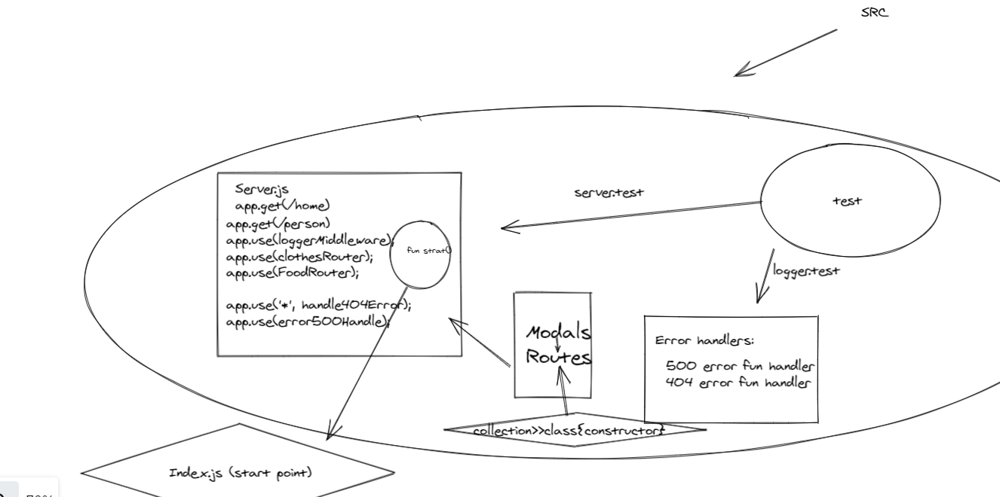

# api-server

## Author: Dima Alabsi

## Setup
 .env requirements
* PORT = 8080
## Running the app

* npm run dev

* Endpoint:  **/status** 

    * Returns Object

{

  ***"domain": "dimaalabsi-api-server.herokuapp.com"***

  ***"status": "running",***

  ***"port": 8080***

}

## Tests

* Unit Tests: npm run test

## Heroku applications 

*   [main branch](https://dimaalabsi-api-server.herokuapp.com/)  
dimaalabsi-api-server.herokuapp.com

## Github actions

*    [actions](https://github.com/DimaAlabsi/api-server/actions)      
github.com/DimaAlabsi/api-server/actions
## pull request

* [last pull request](https://github.com/DimaAlabsi/api-server/pull/1)
github.com/DimaAlabsi/api-server/pull/1

### CI, CD: Continuos Intergration and Continuous Deployment

### deppendicies vs devDependiceis

* "dependencies": Packages required by your application in production and deployment.

* "devDependencies": Packages that are only needed for local development and testing.(supertest, jest)

* Postregs for strucured query language as tables .

## UML

